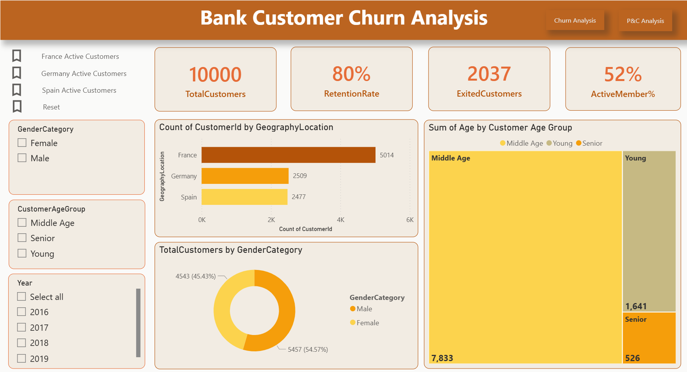
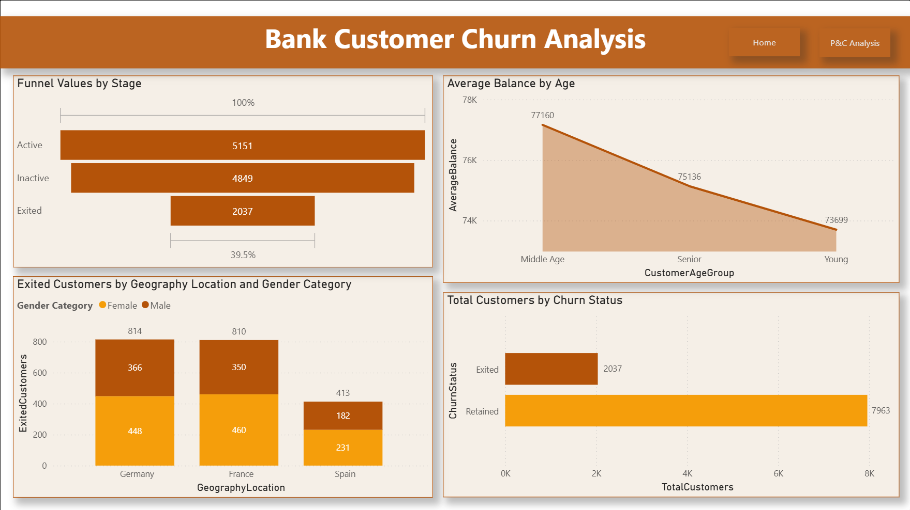
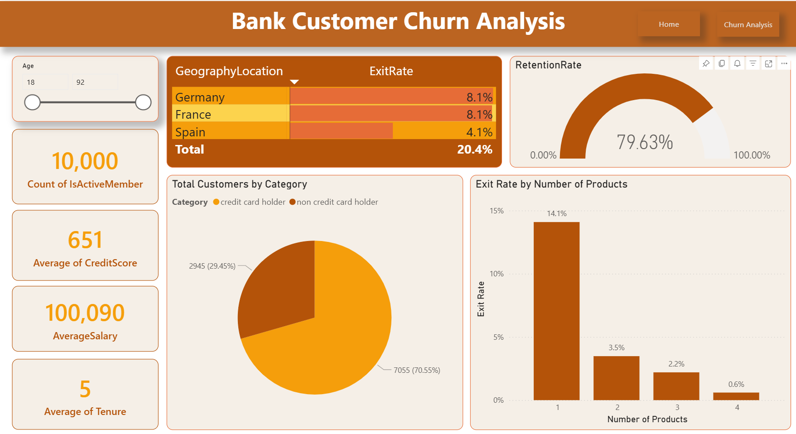

# 📊 Bank Customer Churn Analysis (Power BI)

## 📌 Project Overview
This project analyzes customer churn in a banking system using Power BI. The goal is to identify key factors influencing customer attrition and provide actionable insights to improve retention.

The dashboard provides a comprehensive view of customer behavior based on demographics, geography, credit score, and product usage.

---

## 🎯 Objectives
- Analyze customer churn patterns
- Identify high-risk customer segments
- Compare churn across regions
- Evaluate impact of products and credit score
- Provide business recommendations to reduce churn

---

## 📂 Dataset Information
The dataset consists of multiple tables:

- **CustomerInfo** – Customer demographics and details  
- **Bank_Churn** – Churn status and customer activity  
- **CreditCard** – Credit card ownership data  
- **ActiveCustomer** – Active customer information  
- **ExitCustomer** – Customers who exited  
- **Geography** – Country/region data  
- **Gender** – Gender classification  

---

## 🏗️ Data Model
- Implemented **Star Schema**
- Fact Table: `Bank_Churn`
- Dimension Tables:
  - CustomerInfo
  - Geography
  - Gender
  - CreditCard
  - ActiveCustomer

---

## 📊 Key KPIs
- **Total Customers:** 10000  
- **Retention Rate:** 80%  
- **Exited Customers:** 2037 
- **Active Members %:** 52%  

---

## 📈 Dashboard Features

### 1️⃣ Churn Overview
- Total customers and churn rate
- Active vs exited customers
- Retention performance

### 2️⃣ Customer Segmentation
- Gender-wise distribution
- Age group analysis (Young, Middle Age, Senior)
- Credit card holders vs non-holders

### 3️⃣ Geography Analysis
- Customer distribution by country
- Churn comparison across regions

### 4️⃣ Product Insights
- Exit rate based on number of products
- Customer engagement patterns

### 5️⃣ Funnel Analysis
- Active → Inactive → Exited customer flow

---

## 🔍 Key Insights
- Germany and France have higher churn compared to Spain  
- Customers with **1 product** show highest churn rate  
- Middle-aged customers form the largest segment  
- Non-credit card holders tend to churn more  
- Retention rate is around **68%**, indicating improvement opportunities  

---

## 🛠️ Tools & Technologies
- Power BI  
- DAX  
- Power Query  
- Microsoft Excel  

---

## 📸 Dashboard Preview

### Main Dashboard

### Churn Analysis

### Retention & Insights

---

## 🚀 How to Use
1. Download the `.pbix` file from the Dashboard folder  
2. Open using Power BI Desktop  
3. Interact with filters and slicers  

---

## 💡 Business Recommendations
- Target customers with fewer products (cross-sell strategy)  
- Improve retention strategies in Germany & France  
- Provide incentives for non-credit card users  
- Focus on middle-aged segment for retention campaigns  

---

## 👨‍💻 Author
**Teja Kesarapu**
**https://www.linkedin.com/in/tejakesarapu/**

- Data Analyst  
- Skilled in SQL, Python, Power BI, and Data Visualization  

---

## ⭐ If you found this project useful, please give it a star!
